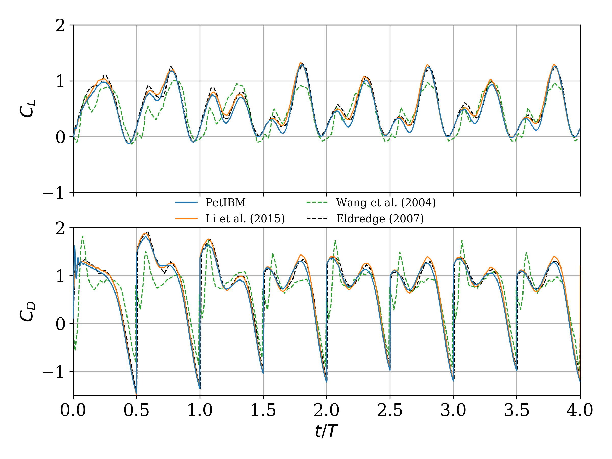

# 2D flow around a flapping wing (Re = 100)

To run the simulation from the current directory:

```bash
export CUDA_VISIBLE_DEVICES=<idx>
mpiexec -np 2 ../../bin/petibm-flapping -options_left -log_view ascii:view.log
```

The simulation takes less than 5 minutes to complete when using:

- 2 CPU processes (Intel(R) Core(TM) i7-3770 CPU @ 3.40GHz),
- 1 NVIDIA K40 GPU device.

To visualize the instantaneous force coefficients:

```bash
python scripts/plot_force_coefficients.py
```

(The Matplotlib figure is saved as a PNG file in the sub-folder `figures` of the simulation directory.)



**Figure 1:** History of the lift (top) and drag (bottom) coefficients over 4 periods. We compare the forces obtained with PetIBM to the results from Li et al. (2015), Wang et al. (2004), and Eldredge (2007).

## References

- Eldredge, J. D. (2007). Numerical simulation of the fluid dynamics of 2D rigid body motion with the vortex particle method. Journal of Computational Physics, 221(2), 626-648.
- Li, C., Dong, H., & Liu, G. (2015). Effects of a dynamic trailing-edge flap on the aerodynamic performance and flow structures in hovering flight. Journal of Fluids and Structures, 58, 49-65.
- Wang, Z. J., Birch, J. M., & Dickinson, M. H. (2004). Unsteady forces and flows in low Reynolds number hovering flight: two-dimensional computations vs robotic wing experiments. Journal of Experimental Biology, 207(3), 449-460.
