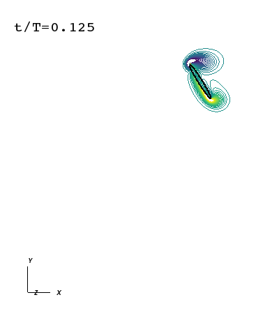

# 2D flow around a flapping wing (Re = 100)

Run the simulation from the current directory:

```bash
cwd=$(pwd)
nvidia-docker run -it --name=flapping --hostname=grumpy -v $cwd:/home/petibm-user/data petibm-flapping:latest /home/petibm-user/data/run.sh
```

The simulation completes 3200 time steps in less than 5 minutes when using:

- 2 CPU processes (Intel(R) Core(TM) i7-3770 CPU @ 3.40GHz),
- 1 NVIDIA K40 GPU device.

To visualize the instantaneous force coefficients:

```bash
python scripts/plot_force_coefficients.py
```

(The Matplotlib figure is saved as a PNG file in the sub-folder `figures` of the simulation directory.)


**Figure 1:** History of the lift (top) and drag (bottom) coefficients over 4 periods. We compare the forces obtained with PetIBM to the results from Li et al. (2015), Wang et al. (2004), and Eldredge (2007).

To plot the contour of the vorticity field using VisIt:

```
python scripts/create_p3d_files.py
visit -nowin -cli scripts/visit_plot_vorticity.py
```

(The PNG files are saved in the sub-folder `figures` of the simulation directory.)



**Figure 2:** Contour of the vorticity field (40 levels between -20 and 20).

Animation created using:

```bash
convert -delay 20 -loop 0 figures/wz*.png figures/wz_anim.gif
```

## References

- Eldredge, J. D. (2007). Numerical simulation of the fluid dynamics of 2D rigid body motion with the vortex particle method. Journal of Computational Physics, 221(2), 626-648.
- Li, C., Dong, H., & Liu, G. (2015). Effects of a dynamic trailing-edge flap on the aerodynamic performance and flow structures in hovering flight. Journal of Fluids and Structures, 58, 49-65.
- Wang, Z. J., Birch, J. M., & Dickinson, M. H. (2004). Unsteady forces and flows in low Reynolds number hovering flight: two-dimensional computations vs robotic wing experiments. Journal of Experimental Biology, 207(3), 449-460.
